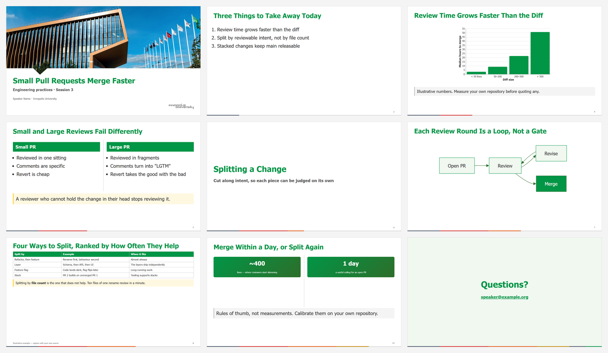
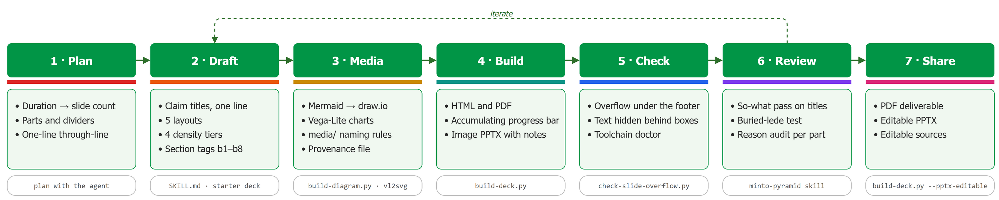

# inno-marp

> [!IMPORTANT]
> **Not an official Innopolis University template.** This is an independent, personal
> project, not produced or endorsed by the university. It comes with **no guarantees** —
> use it at your own discretion, if you find it helpful. For official branding, follow
> the university's own brand guidelines.

**Innopolis University slide decks from Markdown.** A [Marp](https://marp.app) theme, a
diagram and chart pipeline, build and check scripts, and a
[Claude Code](https://docs.claude.com/en/docs/claude-code) skill that knows how to use
them.

```markdown
---
marp: true
theme: innopolis
paginate: true
---

<!-- _class: title -->

# Small Pull Requests Merge Faster
## Engineering practices · Session 3
```

```bash
python scripts/build-deck.py slides.md --pdf
```

→ `slides.html`, `slides.pdf`, a section-coloured progress bar, and a check that nothing
ran off a slide or hid behind a callout box.



## What you get

- **Theme** — Innopolis green, Tahoma, 5 layouts (title, content, columns, divider,
  closing), cards, takeaways and stat boxes.
- **Density tiers** — `dense`, default, `large`, `xl`: body text from 20 to 32 px while
  titles stay put. `xl` makes a deck readable in a video window.
- **Progress bar** — a 4 px line along the bottom of every slide, one colour per
  section. It **accumulates**: finished sections keep their colour, so the audience sees
  how far in they are and how many sections are behind them.
- **Diagrams** — write Mermaid, get an editable draw.io file and an on-brand SVG.
- **Charts** — Vega-Lite templates that match the slide typography.
- **Outputs** — HTML, PDF, image PPTX with notes, editable PPTX via LibreOffice.
- **Checks** — overflow and hidden-text detection on the PDF; a tool doctor.
- **Conventions** — for slide titles, writing, and the `media/` folder, so decks stay
  editable by whoever picks them up next.

## What the skill does at each step

Ask Claude for a deck and the skill loads itself. It then carries each step of the
[workflow](docs/user/workflow.md) — the coloured strips are the progress-bar palette,
one colour per step:



Things to say to it:

- *"Plan a 45-minute deck on code review for an online audience."*
- *"Draw the review flow as a diagram"* · *"Chart these numbers as a bar chart."*
- *"Build the PDF and check nothing overflows."*
- *"Review the slide titles with the minto skill."*
- *"Give me an editable PowerPoint of it."*

## Install with Claude Code

Give Claude Code this prompt:

> *Clone https://github.com/agilebotanist/inno-marp into `.claude/skills/inno-marp`,
> run its `scripts/doctor.py`, and install whatever it reports missing.*

`.claude/skills/` in your decks folder makes it a project skill. Say `~/.claude/skills/`
instead to have it in every project. Manual steps: [docs/user/installation.md](docs/user/installation.md).

Recommended companions:

- the official **draw.io skill** (jgraph) for hand-authored diagrams, and
- the **[minto-pyramid](https://github.com/millwright-labs/minto-pyramid-skill) skill**
  for reviewing a drafted deck's argument — see
  [workflow § 6](docs/user/workflow.md#6-review-with-the-minto-pyramid-skill).

## Documentation

| For | Read |
|-----|------|
| Installing everything | [docs/user/installation.md](docs/user/installation.md) |
| Live preview in VS Code | [docs/user/vscode-preview.md](docs/user/vscode-preview.md) |
| Idea → shared deck, including minto review | [docs/user/workflow.md](docs/user/workflow.md) |
| Layouts, `dense` / `large` / `xl`, the progress bar | [docs/user/layouts-tiers-progress.md](docs/user/layouts-tiers-progress.md) |
| PowerPoint, image vs editable | [docs/user/pptx-export.md](docs/user/pptx-export.md) |
| Something is wrong | [docs/user/troubleshooting.md](docs/user/troubleshooting.md) |
| Every class and token | [references/css-reference.md](references/css-reference.md) |
| Diagrams | [references/diagrams.md](references/diagrams.md) |
| Charts | [references/charts.md](references/charts.md) |
| The `media/` folder | [references/media-conventions.md](references/media-conventions.md) |
| Writing slides that land | [references/slide-writing.md](references/slide-writing.md) |
| Illustrations on dividers | [references/illustrations.md](references/illustrations.md) |
| How it is built, and why | [docs/design/architecture.md](docs/design/architecture.md), [ADRs](docs/design/adr/README.md) |
| What the agent reads | [SKILL.md](SKILL.md) |

## Repository layout

```
inno-marp/
├── SKILL.md                 # the Claude Code skill — the repo IS the skill directory
├── themes/
│   ├── innopolis.template.css   # edit this
│   └── innopolis.css            # generated — never edit
├── assets/                  # title background (source PNG + embedded JPEG)
├── scripts/
│   ├── build-deck.py        # HTML → progress map → PDF → check → PPTX
│   ├── build-diagram.py     # .mmd → .drawio → .svg, re-themed
│   ├── build-progress-map.py
│   ├── build-theme.py       # template + background → innopolis.css
│   ├── check-slide-overflow.py
│   └── doctor.py            # which tools are installed
├── references/              # depth for authors and the agent
├── examples/
│   ├── starter/             # copy this
│   ├── render-test/         # acceptance deck for theme changes
│   └── pitfalls/            # deliberately broken — the checker must fail on it
└── docs/
    ├── user/                # installation, VS Code, workflow, layouts & tiers, PPTX, troubleshooting
    ├── images/              # figures — regenerate with scripts/build-doc-images.py
    └── design/              # architecture + ADRs
```

## Contributing

See [CONTRIBUTING.md](CONTRIBUTING.md). In one line: edit the template, rebuild the
theme, run the render-test deck, record non-obvious decisions as an ADR.

## License

Code and documentation: [MIT](LICENSE). The Innopolis University brand assets (name,
logo, background photograph) are **not** covered — see the note in [LICENSE](LICENSE).
