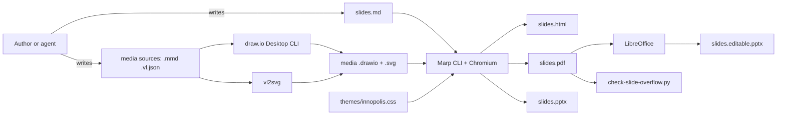

# Architecture

How inno-marp is put together, why, and where to change it. Individual decisions are
recorded as ADRs in [adr/](adr/README.md); this document is the map that ties them
together.

## 1. Purpose

Let anyone produce **Innopolis-branded slide decks from Markdown** — by hand or with a
coding agent — so that decks are:

- **diffable and reviewable** like code (plain text in git),
- **consistent** in look without per-author CSS,
- **editable years later**, including their diagrams,
- **shippable** as PDF (primary), HTML and PPTX.

### Non-goals

- A general Marp theme gallery. One theme, one brand.
- Round-tripping from PowerPoint back to Markdown.
- Rendering Mermaid or Vega-Lite at slide build time.
- Teaching content. The repository carries **no subject matter**; examples use neutral
  topics.

## 2. Quality attributes, in priority order

| # | Attribute | Means |
|---|-----------|-------|
| 1 | **Editability over time** | Every rendered picture has a committed, editable source (`.drawio`, `.vl.json`); a hand-edited diagram is never overwritten |
| 2 | **Portability** | The theme is one self-contained CSS file; scripts are stdlib Python; works on Windows, macOS, Linux |
| 3 | **Legibility at a distance / in a window** | Tiers scale body text, titles never wrap, the progress bar uses distinct hues |
| 4 | **Fail loudly** | Overflow and hidden text are detected on the PDF; missing tools are reported by `doctor.py` |
| 5 | **Low ceremony** | A deck needs three frontmatter lines; one command builds everything |

## 3. Context

External tools are **invoked, never vendored**: Marp CLI, draw.io Desktop, Vega-Lite,
Mermaid CLI, LibreOffice. The repository contains only the theme, scripts, docs and
examples.

## 4. Components

| Component | Files | Responsibility |
|-----------|-------|----------------|
| **Skill contract** | `SKILL.md` | What an agent needs in context: syntax, rules, commands. Loaded on demand by Claude Code |
| **References** | `references/*.md` | Depth an agent (or person) opens only when needed — class catalogue, diagrams, charts, media, writing rules |
| **Theme source** | `themes/innopolis.template.css` | All styling; `{{BG_TITLE}}` placeholder for the background |
| **Theme build** | `scripts/build-theme.py` | Template + `assets/innopolis-bg.jpg` → `themes/innopolis.css` (base64-embedded) |
| **Generated theme** | `themes/innopolis.css` | What Marp and VS Code load. Committed, never hand-edited |
| **Diagram pipeline** | `scripts/build-diagram.py` | `.mmd` → `.drawio` → re-theme → `.svg` via draw.io's CLI |
| **Progress map** | `scripts/build-progress-map.py` | Rendered HTML → per-section gradient → injected into the deck's frontmatter |
| **Deck build** | `scripts/build-deck.py` | Orders the steps: HTML → map → HTML → PDF → check → PPTX(s) |
| **Overflow check** | `scripts/check-slide-overflow.py` | Measures content extent and text hidden behind callouts on the PDF |
| **Doctor** | `scripts/doctor.py` | Reports which tools are installed |
| **Doc figures** | `scripts/build-doc-images.py` | Renders the example decks and composes every figure in `docs/images/` |
| **Pitfalls deck** | `examples/pitfalls/` | Deliberately broken; the overflow checker must fail on it |
| **Acceptance deck** | `examples/render-test/` | 11 slides + assertion table; run after any theme change |
| **Starter deck** | `examples/starter/` | Copyable example of every convention |

### Why two layers of docs

`SKILL.md` is loaded into an agent's context whenever slides come up, so it is kept to
what is needed on nearly every deck. Everything else lives in `references/`, which the
agent opens by link. Human-facing material (installation, VS Code, workflow) lives in
`docs/user/`, and design rationale here — neither is needed to *write* a slide.

## 5. Key mechanisms

### 5.1 Theme as one generated file

Marp resolves `url()` in an inlined theme relative to the **HTML output**, not the CSS
file, so any relative asset path breaks for a deck outside the skill folder. The build
step embeds the title background as base64, making the CSS the only artifact a deck
needs ([ADR 0003](adr/0003-embed-title-background.md)). Tokens are declared on
`section`, not `:root`, so a deck's `style:` can override them
([ADR 0004](adr/0004-tokens-on-section.md)).

### 5.2 Density tiers

Four section classes (`dense`, default, `large`, `xl`) change **body** font sizes
only. The H1 is 42 px everywhere, because a title is the slide's claim and wrapping it
is the one thing it must not do ([ADR 0005](adr/0005-tiers-scale-body-only.md)).

### 5.3 Progress bar

A `section::before` whose width is computed from Marpit's pagination attributes with
typed `attr()` — pure CSS, correct in PDF, degrades to *no bar* where unsupported. The
colour per section comes from `.b1`–`.b8`. Accumulation (finished sections keep their
colour) needs global knowledge CSS cannot have, so `build-progress-map.py` reads the
**rendered HTML** (where carried `class` directives are already resolved) and injects a
gradient into the deck's frontmatter between markers
([ADR 0010](adr/0010-progress-bar.md), [ADR 0011](adr/0011-section-colours-distinct-hues.md)).

### 5.4 Diagram pipeline

Mermaid is the input language because it is terse and agents write it well; draw.io is
the editing surface because hand-adjusted layout must survive; SVG is the output
because it scales and stays small. The importer's styling losses are repaired by a
regex re-theme of the `.drawio`, and the export embeds the diagram XML so the SVG
reopens in the editor ([ADR 0006](adr/0006-diagrams-drawio-first.md),
[0007](adr/0007-retheme-after-import.md), [0008](adr/0008-svg-without-embedded-fonts.md)).

### 5.5 Verification on the PDF

The HTML view scrolls and hides the two real failure modes: content running under the
footer, and content growing *behind* an opaque callout. The checker works on the PDF,
using Chrome's marked-content ids (paint order) to find text drawn before — and inside
— a filled box ([ADR 0013](adr/0013-overflow-check-on-pdf.md)).

### 5.6 PPTX

Image PPTX from Marp keeps fidelity and notes. Editable PPTX goes PDF → LibreOffice's
PDF importer → PPTX, which gives real text boxes at ~10 s instead of Marp's experimental
~140 s internal route, at the cost of notes and table structure
([ADR 0016](adr/0016-outputs-html-pdf-pptx.md)).

## 6. Constraints

- **Canvas 1280×720**, 44 px side padding, 60 px bottom (footer + bar). The image caps
  (560/520/460/440 px) and the checker's 89% content limit are tuned to it.
- **Tahoma** as a system font — nothing embedded, metric-compatible fallbacks.
- **Chrome / Edge / Chromium 133+** for typed `attr()` — Marp CLI renders with the
  browser it detects, and any current one qualifies.
- **Python 3.10+**, stdlib only for the core scripts; `pdfplumber` / `Pillow` optional.
- **Palette duplicated** in three places: the template (source of truth),
  `build-diagram.py` (diagram re-theme), and the chart templates in `references/charts.md`.
  `build-progress-map.py` reads the template directly.

## 7. Risks and known limits

| Risk | Impact | Mitigation |
|------|--------|------------|
| draw.io changes its Mermaid-import defaults | Re-theme regexes stop matching; diagrams come out lavender | Render-test slide 10 asserts the palette; script prints its edit count (0 = suspicious) |
| draw.io importer hangs on some Mermaid | Build blocks | Documented "boring Mermaid" rule; kill-and-simplify guidance |
| Marp changes its pagination attributes or `:root` rewrite | Bar or token overrides break | Render-test assertions for both |
| Theme colour edits do not reach built decks | Inconsistent decks | Documented; re-run the map per deck |
| LibreOffice PDF import quality varies by version | Editable PPTX layout shifts | Documented as a starting point, not a round trip |
| Checker is heuristic | False negatives | Documented as "a net, not a proof"; visual review stays mandatory |

## 8. Extending

| To… | Change | Then |
|-----|--------|------|
| Add a class or component | `themes/innopolis.template.css`, `references/css-reference.md`, a slide in the render-test deck | `build-theme.py`, rebuild render-test, check assertions |
| Change a colour | Template tokens; `build-diagram.py` constants if it is a diagram colour; `charts.md` if a chart colour | Rebuild theme; re-run the progress map on every deck |
| Change the background | `assets/innopolis-bg.png` | `build-theme.py --regen-jpeg` |
| Add a build step | `scripts/build-deck.py` | Update `SKILL.md` § Build and `docs/user/workflow.md` |
| Record a decision | New `docs/design/adr/NNNN-*.md` from the template | Add it to the ADR index |

## 9. Decision index

See [adr/README.md](adr/README.md).
