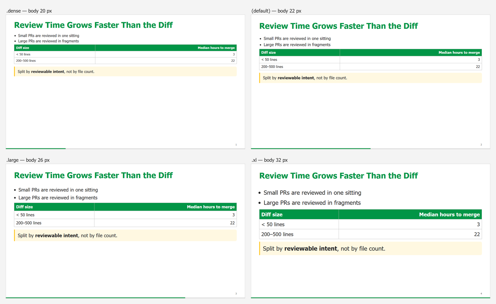
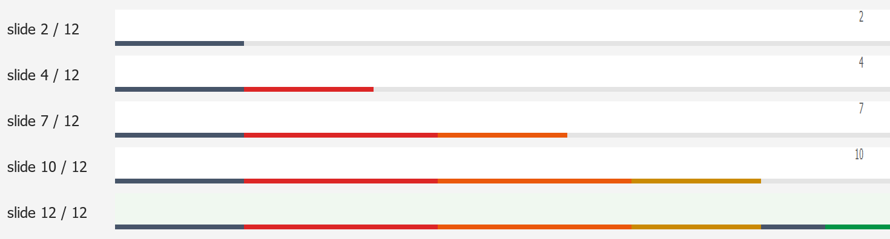
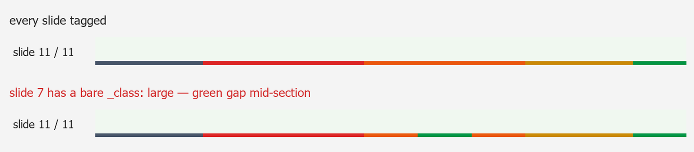

# Layouts, density tiers and the progress bar

Three things you set with **classes**: the *layout* of a slide, its *density tier*
(how big the text is), and the *section colour* of the progress bar. This guide shows
what each looks like and when to use which. The full class catalogue is in
[references/css-reference.md](../../references/css-reference.md).

## First: the two directive forms

Every class goes on a slide through a Marp HTML-comment directive. There are two forms,
and mixing them up causes most of the surprises below.

| Directive | Applies to | Use for |
|-----------|-----------|---------|
| `<!-- _class: large -->` | **this slide only** (underscore) | a one-off tier or layout |
| `<!-- class: xl b2 -->` | **this slide and every slide after it**, until the next `class:` | a deck default, a section colour |
| `class: xl` in the frontmatter | every slide from the start | the deck-wide default tier |

Both forms **replace the whole class list** — they do not add to it. If a slide should
be `large` *and* stay in section 3's colour, it needs both: `<!-- _class: large b3 -->`.

---

## Layouts


| Layout | Directive | Use for |
|--------|-----------|---------|
| `.title` | `<!-- _class: title -->` | The cover. Photo background, no page number, no bar |
| *(default)* | nothing | Content slides |
| `.lead` | `<!-- _class: lead -->` | A section divider — the section's name as `h1`, what it teaches as `h2` |
| `.columns` | `<div class="columns">…</div>` in the body | Two things side by side; each `h2` becomes a green label |
| `.closing` | `<!-- _class: closing -->` | Questions / contact. Light green, centred |

`.columns` is not a slide class but a block inside the slide, so it combines with any
tier. `.columns-3` and `.columns-4` give more columns.

---

## Density tiers — `dense`, `large`, `xl`

The same slide in each of the four tiers:



**What changes:** body text, `h2`/`h3`, tables, list spacing.
**What never changes:** the slide title (42 px in every tier), the layout, the alignment.
So tiers are safe to mix within a deck — titles stay in exactly the same place.

| Tier | Body | Reach for it when… | Typical slide |
|------|-----:|--------------------|---------------|
| `.dense` | 20 px | the slide is a **reference** the audience will read, not glance at | a 5-row comparison table with prose cells |
| *(default)* | 22 px | you present in a room, on a projector | most slides of an in-person talk |
| `.large` | 26 px | the slide carries **one idea** — a summary, a simple comparison, a diagram with a short caption | two columns of three bullets; a chart + one caveat |
| `.xl` | 32 px | the audience watches **in a window on a laptop**, or the slide is a punchline | a hero number; the deck default for online talks |

### Pick the deck default first

- **Online talk, recorded talk, or slides read on a laptop** → put `class: xl` in the
  frontmatter. Small type does not survive a video window.
- **In a room, on a projector** → leave the default.

```yaml
---
marp: true
theme: innopolis
paginate: true
class: xl
---
```

### Then downgrade only the slides that cannot take it

Build, then look at the overflow report ([workflow § 5](workflow.md#5-check)). For each
slide that does not fit:

1. **Cut words first.** A slide that does not fit at `xl` usually says too much.
2. Still does not fit → drop **one** tier: `<!-- _class: large -->`. Typical cases: two
   tables side by side, three columns, a full-width diagram.
3. Only a genuine reference table (five rows or more, prose in the cells) goes to
   `<!-- _class: dense -->`.

Never shrink a slide to fix a **title** that wraps — the title does not change with the
tier anyway. Shorten the title.

### Table-only bumps

`.table-large` (23 px) and `.table-xlarge` (27 px) enlarge a table without enlarging the
text around it — for the slide whose whole point is the table:

```markdown
<!-- _class: table-large -->
```

### Combining a tier with a layout or a section colour

Classes are space-separated, and a per-slide `_class` replaces everything, so name all
of them:

```markdown
<!-- _class: lead b2 -->        divider, section 2's colour
<!-- _class: large b2 -->       large tier, still section 2's colour
<!-- _class: dense b2 -->       dense tier, still section 2's colour
<!-- _class: table-large b2 --> bigger table, still section 2's colour
```

Forget the `b2` and that one slide drops back to green on the bar — see the
[classic mistake](#the-classic-mistake) below.

---

## The progress bar

With `paginate: true`, every slide except the cover carries a 4 px bar along its bottom
edge. It grows left to right — slide *n* of *N* fills *n/N* of the width — and each
**section** has its own colour. Finished sections keep theirs, so the audience sees how
far in they are **and** how many sections are behind them:



### Tag every section

Put two directives on each section's **divider**: one colours the divider itself, one
carries the colour forward to every following slide.

```markdown
<!-- _class: lead b1 -->      ← this divider
<!-- class: xl b1 -->         ← every slide after it (repeat your deck tier!)

# Why Size Matters
## What happens to a review as the diff grows
```

A complete skeleton — agenda and wrap-up in slate, three sections in spectrum order:

```markdown
<!-- _class: title -->
# Deck Title
---
<!-- class: xl b8 -->
# Three Things to Take Away Today          ← agenda: slate bookend
---
<!-- _class: lead b1 -->
<!-- class: xl b1 -->
# Section One                              ← red from here
---
# …content…
---
<!-- _class: lead b2 -->
<!-- class: xl b2 -->
# Section Two                              ← orange from here
---
<!-- _class: large b2 -->
# …a one-idea slide, still orange…
---
<!-- _class: lead b3 -->
<!-- class: xl b3 -->
# Section Three                            ← gold from here
---
<!-- class: xl b8 -->
# Try It on Your Next Change               ← wrap-up: slate bookend
---
<!-- _class: closing -->
# Questions?
```

The colours, in the order to use them:

| Class | Colour | Use |
|-------|--------|-----|
| `b1` | red | 1st section |
| `b2` | orange | 2nd |
| `b3` | gold | 3rd |
| `b4` | teal | 4th |
| `b5` | blue | 5th |
| `b6` | violet | 6th |
| `b7` | magenta | 7th |
| `b8` | slate | bookends: agenda, wrap-up, logistics |
| *(none)* | green | untagged — the cover share and the closing slide |

Seven content sections is already more than a 90-minute talk should have. **Always walk
the list in order** — adjacent sections then always differ in hue. Avoid `b1d`…`b6d`
(lighter shades of the same hues): two shades of one hue blur into one line at 4 px.

### Make it accumulate

Without extra help, the whole bar is the current section's colour — CSS on one slide
cannot know where the other sections start. `build-deck.py` works that out from the
rendered deck and writes it into your frontmatter, so just build as usual:

```bash
python <skill-dir>/scripts/build-deck.py slides.md --pdf
```

```
12 slides, 6 sections -> slides.md
  #475569              slides 1-2
  #dc2626              slides 3-5
  #ea580c              slides 6-8
  #ca8a04              slides 9-10
  #475569              slides 11-11
  #019546              slides 12-12
```

**Read that listing.** It is the fastest check that the bar matches your plan: one row
per section, boundaries where your dividers are. More rows than sections means a slide
lost its tag.

The generated block sits in your frontmatter between two marker comments. Do not edit
it — it is rewritten on every build. It is refreshed automatically by `build-deck.py`;
if you build with `marp` directly, re-run
`python <skill-dir>/scripts/build-progress-map.py slides.md` after adding, removing or
retagging slides.

### The classic mistake

A per-slide `<!-- _class: large -->` inside a section **replaces** the carried `b2`, so
that one slide is untagged — and the bar shows a green gap in the middle of the section:



Fix: `<!-- _class: large b2 -->`. The generator's listing gives it away — section two
appears as three rows (orange, green, orange) instead of one.

### Adjusting it for one deck

In the deck's frontmatter `style:` block:

```yaml
style: |
  section::before { height: 2px; }                   /* thinner             */
  section.lead::before { display: none; }            /* none on dividers    */
  section { --inno-progress-track: transparent; }    /* no grey track       */
```

To turn it off entirely, combine two of those:
`section::before { display: none; }` and `section { --inno-progress-track: transparent; }`.
(Dropping `paginate: true` is not enough — it empties the bar and removes page numbers,
but the grey track stays.)

---

## Cheat sheet

| I want… | Write |
|---------|-------|
| Big type everywhere (online talk) | `class: xl` in the frontmatter |
| One slide smaller | `<!-- _class: large bN -->` (keep the section's `bN`) |
| A reference table that fits | `<!-- _class: dense bN -->` |
| Just the table bigger | `<!-- _class: table-large bN -->` |
| Start section N | `<!-- _class: lead bN -->` + `<!-- class: xl bN -->` |
| Agenda / wrap-up | `<!-- class: xl b8 -->` |
| Back to no section | `<!-- class: xl -->` |
| Accumulating bar | build with `build-deck.py` |
