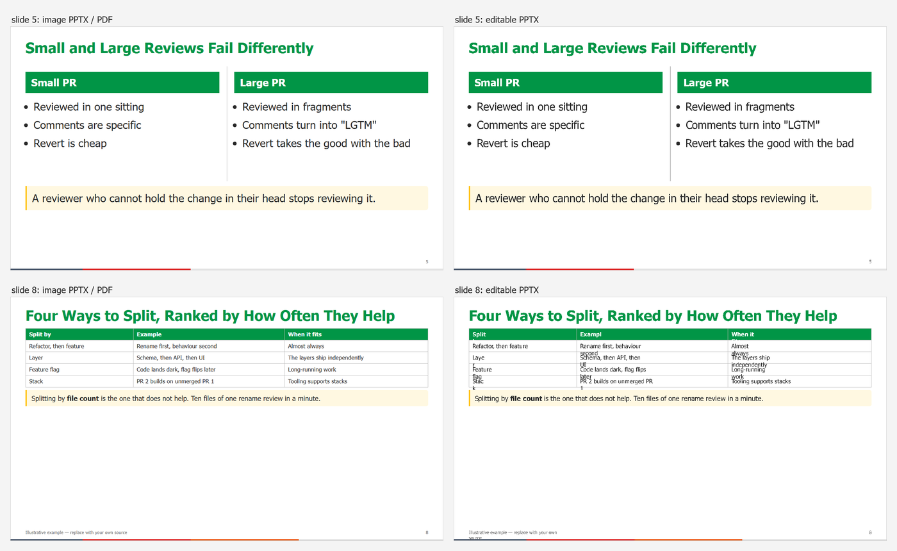

# PowerPoint export

Marp is the source of truth; PowerPoint is a hand-over format. There are two kinds of
PPTX, and they trade off different things.

| | Image PPTX | Editable PPTX |
|---|---|---|
| Command | `build-deck.py slides.md --pptx` | `build-deck.py slides.md --pptx-editable` |
| Output | `slides.pptx` | `slides.editable.pptx` |
| Each slide is | one full-slide picture | real text boxes and vector shapes |
| Text editable | no | **yes** — titles, bullets, callouts, even chart and diagram labels |
| Looks identical to the PDF | yes | close; **tables and tight boxes break** (below) |
| Speaker notes | **yes** | **no** — lost |
| Needs | Marp + a Chromium browser | also **LibreOffice** |
| Time | one Chromium render, like the PDF | ~10 s on top of the PDF (12 slides) |

**Pick by what the recipient will do.** Presenting it or reading it: image PPTX, or just
the PDF. Changing words, reusing slides in their own deck: editable PPTX. If both matter,
send both.

## Editable PPTX

```bash
python <skill-dir>/scripts/build-deck.py slides.md --pptx-editable
```

This builds the PDF, then has LibreOffice import it and save it as PowerPoint:

```bash
soffice --headless --infilter="impress_pdf_import" \
  --convert-to "pptx:Impress MS PowerPoint 2007 XML" --outdir out/ slides.pdf
```

Both flags matter. Without `--infilter`, LibreOffice opens the PDF in **Draw**, which
cannot write PPTX. The output is named after the PDF (`slides.pptx`), which is why
`build-deck.py` converts into a temporary folder and renames the result to
`slides.editable.pptx`: it would otherwise overwrite the image PPTX.

### marp's own flag

Marp CLI can do the same in one step:

```bash
marp slides.md --theme <skill-dir>/themes/innopolis.css --allow-local-files --html \
  --pptx --pptx-editable -o slides.editable.pptx
```

It is marked **experimental** and goes through LibreOffice as well, giving the same
result — but it re-renders the deck internally and took ~140 s where the PDF route took
~10 s. Use it if you have no PDF and want a single command.

### What breaks, and how to fix it

LibreOffice rebuilds every line of text as a **fixed-width text box** at the position it
had in the PDF. That preserves the look of flowing text well, and fails where text
was laid out in narrow cells. Left, the image PPTX (identical to the PDF); right, the
editable PPTX of the same slides:



| Element | Result | Fix |
|---------|--------|-----|
| Titles, bullets, columns, `.takeaway`, `.box`, stat boxes | Faithful and editable | — |
| SVG charts and diagrams | Vector shapes; labels are editable text | — |
| Title background | Kept as a picture | — |
| **Tables** | Cells become separate boxes; words split mid-word; rows overlap | Delete and re-insert as a native PowerPoint table, or paste the table as a picture from the PDF |
| **Footers** | Long citations wrap onto a second line | Widen the box |
| Progress bar | A static shape, frozen at that slide's state | Leave it, or delete it |
| Speaker notes | **Missing** | Copy from `slides.md` comments, or from the image PPTX |
| Editing a bullet so it grows | Does not reflow the boxes below it | Move boxes by hand — or edit in Marp and re-export |

If a deck is meant to be edited in PowerPoint for the long term, the editable export is
a **starting point**, not a round trip: changes made in PowerPoint do not come back to
`slides.md`.

### Fonts

The PPTX names **Tahoma**. On a machine without it, PowerPoint substitutes and line
breaks shift. Windows and macOS have Tahoma; on Linux install it before judging the
layout.

## Troubleshooting

| Symptom | Cause | Fix |
|---------|-------|-----|
| `LibreOffice produced no PPTX` | Another LibreOffice window is open and holds the profile | Close LibreOffice completely, retry |
| `LibreOffice not found` | `soffice` not on PATH | Install it, or set `SOFFICE` to `soffice.exe` / `soffice` |
| `[soffice] Could not find platform independent libraries` | Harmless warning from LibreOffice's bundled Python | Ignore |
