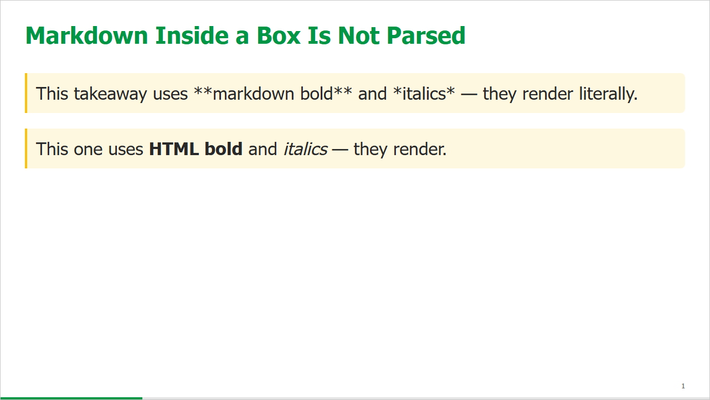
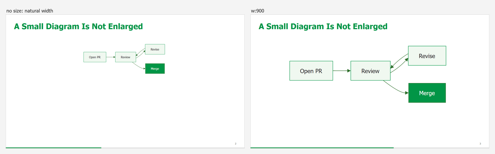
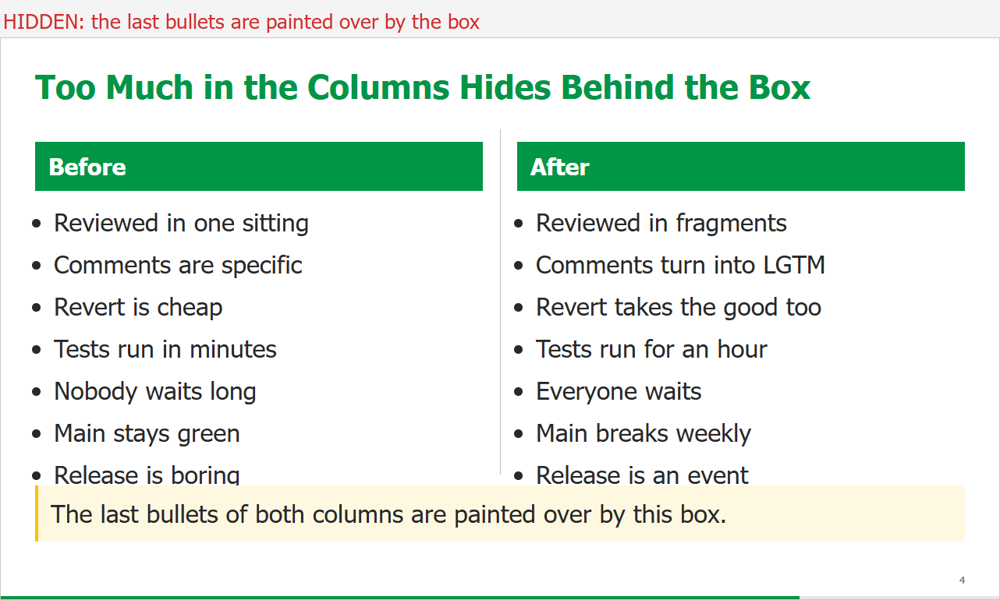
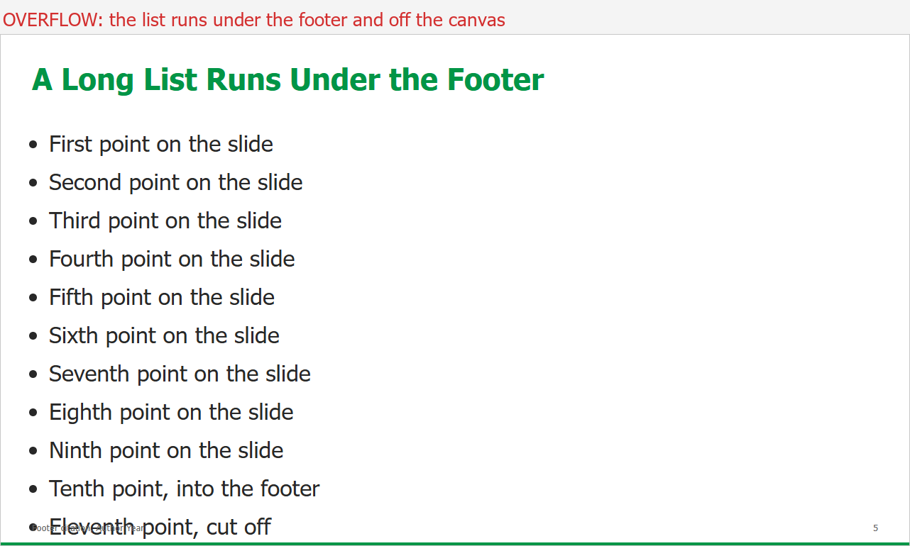

# Troubleshooting

Start with `python <skill-dir>/scripts/doctor.py`.

## What the common failures look like

All four come from [examples/pitfalls/](../../examples/pitfalls/README.md), a deck
broken on purpose.

**Markdown inside an HTML block is printed literally.** Use `<strong>` / `<em>` inside
`
`s.

**A small diagram is not enlarged.** The theme only *shrinks* images to fit. Give a
wide diagram a width: ``.

**Text hidden behind a box.** Columns that are too tall grow *behind* the opaque
takeaway. The overflow check reports it as `HIDDEN`; cut bullets or drop a tier.

**Content under the footer.** A long list runs past the bottom of the canvas. Reported
as `OVERFLOW`; cut, split the slide, or drop a tier.

A **green gap in the progress bar** is the fifth common one — a slide inside a section
that lost its section class. Picture and fix:
[layouts-tiers-progress.md § The classic mistake](layouts-tiers-progress.md#the-classic-mistake).

## Rendering

| Symptom | Cause | Fix |
|---------|-------|-----|
| Deck renders in plain Marp style, no green | Theme not registered | Pass `--theme <skill-dir>/themes/innopolis.css`; in VS Code check the path in `markdown.marp.themes` ([vscode-preview.md](vscode-preview.md)) |
| `
` shows as literal text or collapses | HTML disabled | Add `--html`; in VS Code set `"markdown.marp.html": "all"` |
| `**bold**` shows asterisks inside a box | Markdown inside an HTML block is not parsed | Use `<strong>`, `<em>`, ` ` inside `
`s |
| Markdown in a `.columns` column not rendered | No blank lines inside the inner `
` | Leave a blank line after `
` and before `
` |
| Local images missing in PDF/PNG | Local file access blocked | Add `--allow-local-files` |
| Page count is one more than the slide count, blank step | `![bg]` directive | Remove it; use `.title` / `.lead` / `.closing` |
| A citation appears on every later slide | Footer not reset | `<!-- footer: "" -->` on the next slide |
| Title wraps onto two lines | Too long for 42 px | Shorten the title — do not override its size |
| Diagram tiny in the middle of the slide | The theme caps images but never enlarges them | `` for a wide diagram |
| Letterbox gaps above and below a diagram | `h:N` on a wide diagram | Drop `h:N`; use `w:N` or nothing |

## Progress bar

| Symptom | Cause | Fix |
|---------|-------|-----|
| Bar is green for most of the deck | Sections not tagged | Tag every divider `lead bN` + `class: xl bN` |
| Bar flashes green on one slide mid-section | A `_class: large` without the section class | Write `<!-- _class: large b3 -->` |
| Bar is one colour, does not accumulate | No section map | Run `build-deck.py` (or `build-progress-map.py`) |
| Section boundaries slightly off | Map computed from a stale `slides.html` | Rebuild HTML, re-run the map, rebuild |
| Old colours after changing the theme | Map holds literal hex | Re-run the map for every deck |
| Two adjacent sections look like one | Two shades of one hue (`b1` + `b1d`, or `b1` + `b7`) | Use distinct hues in spectrum order |
| No bar at all | `paginate: true` missing, or a browser without typed `attr()` | Add `paginate: true`; Marp's own Chromium supports it |

## Diagrams

| Symptom | Cause | Fix |
|---------|-------|-----|
| `draw.io Desktop CLI not found` | Not installed, or elsewhere | [Install it](installation.md#drawio-desktop), or set `DRAWIO_CLI` |
| `build-diagram.py` hangs with no output | `%%{init}%%`, inline HTML or entities in the `.mmd` | Kill the `draw.io` processes; strip the source to plain `A --> B` lines |
| Diagram in lavender and grey | Built with `--no-theme`, or exported by hand from the `.mmd` | Run `build-diagram.py` on it |
| Hand edits disappeared | `.mmd` re-run over an edited `.drawio` | Restore the `.drawio` from git; from now on build from the `.drawio` and mark it hand-owned |
| SVG is hundreds of KB, text not selectable | Exported with embedded fonts | Re-export with `--embed-svg-fonts false` (the script does) |
| Crash exporting `.mmd` straight to SVG | Known draw.io bug with `-e` on Mermaid input | Convert to `.drawio` first (the script does) |
| draw.io fails on a Linux server | No display | `xvfb-run python scripts/build-diagram.py …` |

## PDF / PPTX

| Symptom | Cause | Fix |
|---------|-------|-----|
| PDF build fails, mentions a browser | No Chrome/Edge/Chromium found | Install one, or set `CHROME_PATH` |
| Two builds hang forever | Two PDF builds in parallel, each with its own Chromium | Kill them; build PDFs one at a time |
| `npx @marp-team/marp-cli` hangs | npx re-resolves the package every call | `npm i -g @marp-team/marp-cli`, call `marp` |
| Overflow check reports text `HIDDEN` | Content grew behind a `.takeaway` / `.box` | Cut words or drop the slide a tier |
| Overflow check prints `FontBBox` warnings | Harmless pdfplumber message about embedded fonts | Ignore |
| Editable PPTX: tables garbled, notes missing | Expected limits of the LibreOffice route | See [pptx-export.md](pptx-export.md#what-breaks-and-how-to-fix-it) |

## Theme maintenance

| Symptom | Cause | Fix |
|---------|-------|-----|
| Edits to `innopolis.css` vanished | It is generated | Edit `innopolis.template.css`, run `build-theme.py` |
| `doctor.py` says theme STALE | Template newer than the generated CSS | `python scripts/build-theme.py` |
| Title background missing for decks elsewhere | Background referenced by path, not embedded | Rebuild with `build-theme.py` — it embeds the JPEG |
