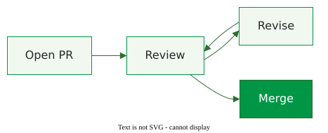

<!-- Deliberately broken deck. Every slide shows one common mistake.
     check-slide-overflow.py MUST exit 1 on it — see README.md. -->

# Markdown Inside a Box Is Not Parsed

This takeaway uses **markdown bold** and *italics* — they render literally.

This one uses <strong>HTML bold</strong> and <em>italics</em> — they render.

---

# A Small Diagram Is Not Enlarged

---

# A Small Diagram Is Not Enlarged

---

# Too Much in the Columns Hides Behind the Box

## Before

- Reviewed in one sitting
- Comments are specific
- Revert is cheap
- Tests run in minutes
- Nobody waits long
- Main stays green
- Release is boring

## After

- Reviewed in fragments
- Comments turn into LGTM
- Revert takes the good too
- Tests run for an hour
- Everyone waits
- Main breaks weekly
- Release is an event

The last bullets of both columns are painted over by this box.

---

# A Long List Runs Under the Footer

- First point on the slide
- Second point on the slide
- Third point on the slide
- Fourth point on the slide
- Fifth point on the slide
- Sixth point on the slide
- Seventh point on the slide
- Eighth point on the slide
- Ninth point on the slide
- Tenth point, into the footer
- Eleventh point, cut off
- Twelfth point, gone

<!-- footer: Footer citation, Author Year -->
