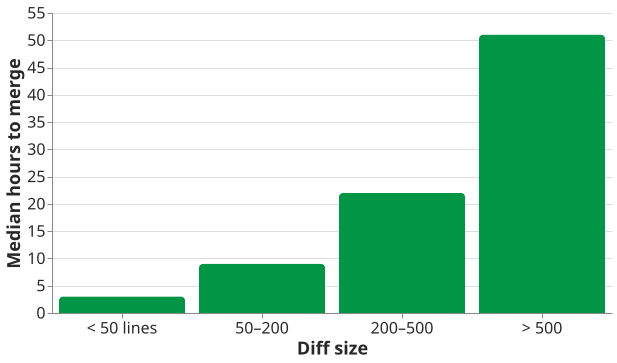

<!-- _class: title -->

# Small Pull Requests Merge Faster
## Engineering practices · Session 3

Speaker Name · Innopolis University

---

<!-- class: xl b8 -->

# Three Things to Take Away Today

1. Review time grows faster than the diff
2. Split by reviewable intent, not by file count
3. Stacked changes keep main releasable

<!-- Speaker notes: any HTML comment that is not a directive. Say which of the three the room cares about most, and spend the reserve there. -->

---

<!-- _class: lead b1 -->
<!-- class: xl b1 -->

# Why Size Matters
## What happens to a review as the diff grows

📁 ill-part1-review-queue.png | 🎨 840x315px | Three panels: dev opens a 2,000-line PR; the reviewer's face; the reviewer types "LGTM".

Credit line goes here

---

<!-- _class: large b1 -->

# Review Time Grows Faster Than the Diff

Illustrative numbers. Measure your own repository before quoting any.

---

# Small and Large Reviews Fail Differently

## Small PR

- Reviewed in one sitting
- Comments are specific
- Revert is cheap

## Large PR

- Reviewed in fragments
- Comments turn into "LGTM"
- Revert takes the good with the bad

A reviewer who cannot hold the change in their head stops reviewing it.

---

<!-- _class: lead b2 -->
<!-- class: xl b2 -->

# Splitting a Change
## Cut along intent, so each piece can be judged on its own

---

<!-- _class: large b2 -->

# Each Review Round Is a Loop, Not a Gate

---

<!-- _class: dense b2 -->

# Four Ways to Split, Ranked by How Often They Help

| Split by | Example | When it fits |
|----------|---------|--------------|
| Refactor, then feature | Rename first, behaviour second | Almost always |
| Layer | Schema, then API, then UI | The layers ship independently |
| Feature flag | Code lands dark, flag flips later | Long-running work |
| Stack | PR 2 builds on unmerged PR 1 | Tooling supports stacks |

Splitting by <strong>file count</strong> is the one that does not help. Ten files of one rename review in a minute.

<!-- footer: Illustrative example — replace with your own source -->

---

<!-- footer: "" -->
<!-- _class: lead b3 -->
<!-- class: xl b3 -->

# Keeping Main Releasable
## Merge often without shipping half a feature

---

# Merge Within a Day, or Split Again

  ~400
  lines — where reviewers start skimming

  1 day
  a useful ceiling for an open PR

Rules of thumb, not measurements. Calibrate them on your own repository.

---

<!-- class: xl b8 -->

# Try It on Your Next Change

- Open the refactor on its own first
- Keep the behaviour change under 400 lines
- Ask for review the same day

---

<!-- _class: closing -->

# Questions?

## speaker@example.org
