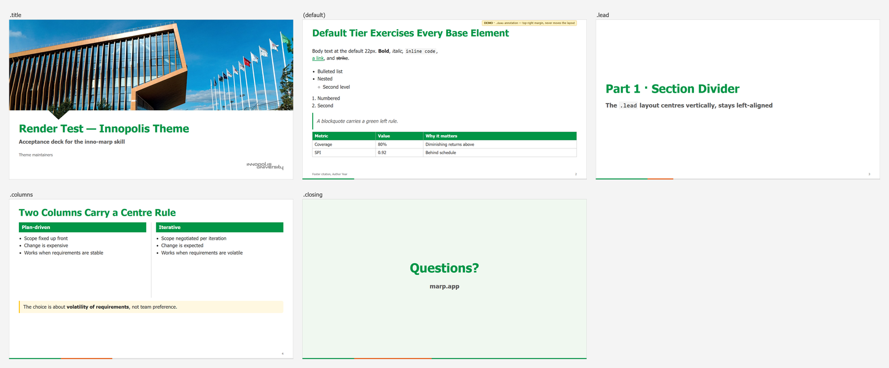

# CSS / Class Reference — Innopolis theme

The theme lives at [`themes/innopolis.css`](../themes/innopolis.css), generated from
[`themes/innopolis.template.css`](../themes/innopolis.template.css). **Never edit the
generated file** — edit the template and re-run `python scripts/build-theme.py`.

A deck references the theme; it never pastes CSS into its frontmatter:

```yaml
---
marp: true
theme: innopolis
paginate: true
---
```

---

## Design tokens

Declared on `section` — **not** `:root`, and that matters. Marp rewrites a theme's
`:root` as `:where(section):not([\20 root])`, whose `:not([…])` counts an attribute in
the specificity, so a `:root` token silently outranks a deck's own
`section { --token: … }` however late it comes. On `section`, theme and deck are at
equal specificity and the deck's `style:` block wins on order. See
[ADR 0004](../docs/design/adr/0004-tokens-on-section.md).

| Token | Hex | Use |
|-------|-----|-----|
| `--inno-green` | `#019546` | Primary — H1, table headers, borders, column pills |
| `--inno-green-dark` | `#2D6E2A` | H2/H3, gradient end |
| `--inno-green-light` | `#81c784` | Tertiary fills |
| `--inno-card-green` | `#f0f8f0` | `.box`, `.placeholder`, `.closing` background |
| `--inno-yellow` | `#ffc107` | `.takeaway` / `.box.y` border, `.chip` |
| `--inno-card-yellow` | `#fff8e1` | `.takeaway` / `.box.y` background |
| `--inno-red` | `#d32f2f` | `.box.r` border |
| `--inno-card-red` | `#fdecea` | `.box.r` background |
| `--inno-text` | `#282828` | Body text |
| `--inno-muted` | `#555555` | Blockquotes, subtitles |
| `--inno-footer` | `#666666` | Footers, page number, captions |
| `--inno-gray` | `#f4f4f4` | Code background, `.box.n` |
| `--inno-rule` | `#bbbbbb` | Column separator, table borders |
| `--inno-progress` | `#019546` | Filled part of the progress bar (repainted by `.b1`–`.b8`) |
| `--inno-progress-track` | `#e4e4e4` | Its unfilled remainder |
| `--inno-progress-map` | *(generated)* | Accumulating section map — see below |
| `--inno-b1` … `--inno-b8` | see below | Section colours for the bar |

**Font:** Tahoma, falling back to Verdana → DejaVu Sans → Geneva. System fonts only,
nothing embedded. Base body 22 px on a 1280×720 canvas.

---

## The 5 layouts



Usage guide with pictures of tiers and the progress bar:
[docs/user/layouts-tiers-progress.md](../docs/user/layouts-tiers-progress.md).

| Class | Purpose | Directive |
|-------|---------|-----------|
| `.title` | Cover slide, Innopolis photo background, content bottom-aligned | `<!-- _class: title -->` |
| *(default)* | Content slide, white, H1 pinned to top | *(none)* |
| `.columns` | Two-column grid with a centre rule | wrap content in `<div class="columns">` |
| `.lead` | Section divider, vertically centred, left-aligned, H1 52 px | `<!-- _class: lead -->` |
| `.closing` | Thank-you / questions, light green, centred, H1 56 px | `<!-- _class: closing -->` |

`.title` hides the page number and the progress bar. `.closing` hides the number but
keeps the bar, which reads full on the last slide.

`.two-col` aliases `.columns`. `.columns-3` and `.columns-4` give three and four columns
— without the centre rule, which would land mid-column.

---

## Density tiers — 4 sizes

Tiers change **body font sizes only**. They never re-centre, hide anything, or change
the structure — and **they never change the slide title**, which is 42 px in every tier
([ADR 0005](../docs/design/adr/0005-tiers-scale-body-only.md)).

| Tier | Body | H1 | H2 | H3 | Table | Use |
|------|-----:|---:|---:|---:|------:|-----|
| `.dense` | 20 | 42 | 24 | 18 | 17 | Reference tables, deep bullets |
| *(default)* | 22 | 42 | 28 | 20 | 19 | Most slides |
| `.large` | 26 | 42 | 30 | 22 | 22 | Emphasis, summaries, simple comparisons |
| `.xl` | 32 | 42 | 36 | 28 | 28 | Hero stat, punchline; deck default for online delivery |

### Table-only bumps

| Class | Table font |
|-------|-----------|
| `.table-large` | 23 px |
| `.table-xlarge` | 27 px (29 px as a section class) |

---

## Content modifiers

Combine freely with any tier.

| Class | Purpose |
|-------|---------|
| `.takeaway` | Yellow box with a yellow left rule — the key insight |
| `.stat-box` | Green gradient block for a single number |
| `.box` | Content card, green tint |
| `.box.y` | Caution |
| `.box.r` | Alert or anti-pattern |
| `.box.n` | Aside, caveat, data note |
| `.chip` | Inline yellow label |
| `.placeholder` | Dashed green box for a visual not yet made |
| `.comic-placeholder` / `.comic-caption` | Illustration slot on a divider — see [illustrations.md](illustrations.md) |
| `.demo` | Tutorial annotation: a dashed **DEMO** note in the top-right margin saying what the slide demonstrates. Absolutely positioned, so it never moves the layout. For example and training decks — delete it from real ones |

`.takeaway` and `.box` are **opaque and in the normal flow**. When the content above
one is too tall, it grows *behind* the box and disappears — the text is still in the
PDF, so it looks fine to a text search. `scripts/check-slide-overflow.py` detects it.

---

## Usage

### Two columns with a centre rule

```html
<div class="columns">
<div>

## Plan-driven

- Scope fixed up front
- Change is expensive

</div>
<div>

## Iterative

- Scope negotiated per iteration
- Change is expected

</div>
</div>
```

The blank lines inside each `<div>` matter: they let Marp parse the markdown between
the tags. An `h2` in a column renders as a **full-width green pill**. An `h1` in a
column is treated as a nested example (28 px), not the slide title.

The separator is a 1 px background gradient, not a border: it sits behind all column
content, spans the full height whichever column is taller, and renders reliably inside
Marp's `<foreignObject>`.

### Takeaway, stat box, cards, chip, placeholder

```html
<div class="takeaway">Split by <strong>reviewable intent</strong>, not by file count.</div>

<div class="stat-box">
  <span class="number">0.92</span>
  <span class="label">Schedule Performance Index</span>
</div>

<div class="box">Neutral note</div>
<div class="box y">Caution — this is where teams get it wrong</div>
<div class="box r">Anti-pattern — never do this</div>
<div class="box n">Chart reconstructed from the source's figure</div>

<span class="chip">NEW</span>

<div class="placeholder">Diagram: request flow through the review queue</div>
```

---

## Image sizing

The theme caps every image so a diagram cannot escape the slide;
`object-fit: contain` keeps the aspect ratio.

| Context | Auto `max-height` |
|---------|-------------------|
| Default content slide | 560 px |
| Inside `.columns` | 520 px |
| `.dense` | 460 px |
| `.dense` inside `.columns` | 440 px |

`` / `` emits an inline style and overrides the cap. Only use
`h:N` for **tall + narrow** images — see [diagrams.md § Sizing](diagrams.md#sizing).

---

## Slide chrome — footer, page number, progress bar

| Element | Where | Notes |
|---------|-------|-------|
| Footer | `bottom: 15px; left: 44px`, 13 px | `<!-- footer: … -->`, per slide or global |
| Page number | `bottom: 15px; right: 44px`, 13 px | Same baseline as the footer; needs `paginate: true` |
| Progress bar | Bottom edge, 4 px | Grows left→right over a grey track; needs `paginate: true` |

The page number has explicit coordinates because Marpit's own rule positions it with
`padding: inherit`, which would float it ~45 px above the footer.

The bar's width comes straight from the attributes Marpit stamps on every section,
via typed `attr()`:

```css
width: calc(100% * attr(data-marpit-pagination type(<number>), 0)
                 / attr(data-marpit-pagination-total type(<number>), 1));
```

No JavaScript, correct in the PDF too. Typed `attr()` needs Chrome 133+; where it is
unsupported the declaration is dropped and the bar simply disappears — it cannot break
the layout ([ADR 0010](../docs/design/adr/0010-progress-bar.md)).

### Colour the bar by section

`.b1`–`.b8` repaint `--inno-progress`. Set it once per section with the
**non-underscore** `class` directive, which carries until changed:

```markdown
<!-- _class: lead b3 -->      ← the divider slide
<!-- class: xl b3 -->         ← and every slide after it

# Section Three
```

- `class` **replaces** the whole list — repeat the tier (`xl b3`), and end with a plain
  `<!-- class: xl -->` to return to green.
- A per-slide `<!-- _class: large -->` wipes the carried class for that slide — write
  `<!-- _class: large b3 -->`.
- With no global tier, `<!-- class: "" -->` clears the carried class.

| Class | Hex | Use |
|-------|-----|-----|
| `.b1` | `#dc2626` red | 1st content section |
| `.b2` | `#ea580c` orange | 2nd |
| `.b3` | `#ca8a04` gold | 3rd |
| `.b4` | `#0d9488` teal | 4th |
| `.b5` | `#2563eb` blue | 5th |
| `.b6` | `#7c3aed` violet | 6th |
| `.b7` | `#db2777` magenta | 7th |
| `.b8` | `#475569` slate | bookends — agenda, wrap-up, logistics |
| *(none)* | `#019546` green | untagged |
| `.b1d`–`.b6d` | 400 shades | legacy; do not use for adjacent sections |

Seven content sections is more than a 90-minute talk should have. If a series of decks
wants a colour to *mean* something across decks (topic *X* is always teal), that is a
per-series convention layered on top — document it in the series, not here.
Rationale: [ADR 0011](../docs/design/adr/0011-section-colours-distinct-hues.md).

### Make the bar accumulate — the section map

By default the whole bar is the current section's colour. To have it *build up*, the
theme needs to know where each section starts, which per-slide CSS cannot work out.
Generate it:

```bash
marp slides.md --theme <skill-dir>/themes/innopolis.css --allow-local-files --html -o slides.html
python <skill-dir>/scripts/build-progress-map.py slides.md
# then rebuild html + pdf    (build-deck.py does all of this)
```

The script reads the **rendered HTML** (where Marp has already resolved carried
`class` directives), collapses runs of same-coloured slides into sections, and writes a
`--inno-progress-map` gradient into the frontmatter between markers, rewriting it in
place on every run. The cover slide's share is folded into the first section.

Two ways the map goes stale:

- **Stale HTML.** The map is computed over whatever `slides.html` contains. Compare the
  PDF page count with the slide count before trusting it.
- **Theme colour change.** The map holds literal hex; editing `--inno-b*` does not reach
  a built deck until the script is re-run for it.

Retune per deck:

```yaml
style: |
  section::before { height: 2px; }                   /* thinner             */
  section { --inno-progress: #999; }                 /* neutral everywhere  */
  section { --inno-progress-track: transparent; }    /* fill only           */
  section.lead::before { display: none; }            /* drop it on dividers */
```

---

## Per-deck overrides

A `style:` block in the frontmatter cascades over the theme:

```yaml
---
marp: true
theme: innopolis
paginate: true
style: |
  section { --inno-rule: #d8e8d8; }
  section.dense table { font-size: 15px; }
---
```

Keep `style:` the **last** frontmatter key — `build-progress-map.py` appends to it. If
the same override recurs across decks, promote it into the template and rebuild.
